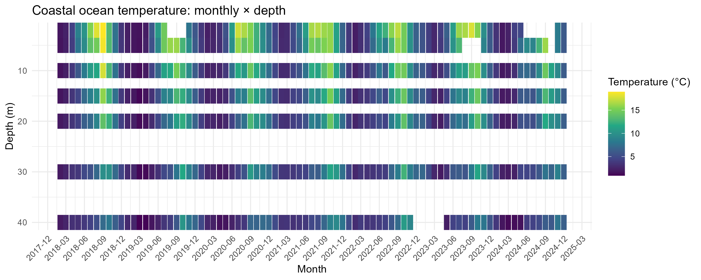
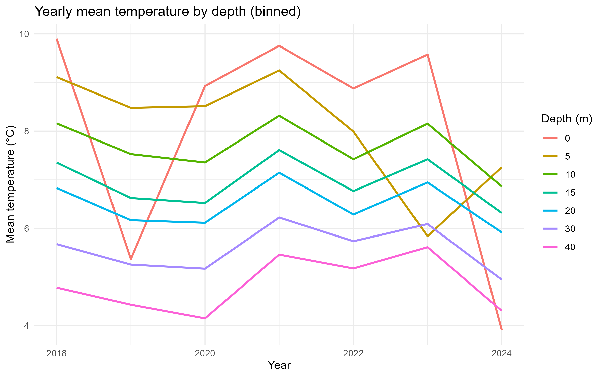

## はじめに

本レポートでは、TidyTuesdayで公開されている「Coastal Ocean Temperature by Depth（沿岸海洋の水深別水温）」データセットを用いて、沿岸海域における水温変化の特徴を分析した。
このデータセットは、カナダ・ノバスコシア州のLunenburg County Water Quality Dataをもとに作成されたものであり、沿岸海域における水温を異なる水深ごとに観測した記録が含まれている。

海洋水温は、生態系や漁業、気候変動などと密接に関係している。特に沿岸域では、季節変化や水深による温度差が大きく、海洋環境の理解において重要な指標となる。そのため、本データセットを分析することで、「水深によって水温はどのように異なるのか」「季節ごとにどのような変化が見られるのか」といった問いに答えることを目的とした。

## 図１：水深別月ごとの温度変化

{width="100%"}
このヒートマップから、沿岸海洋の水温には強い季節変動があることが分かる。毎年、夏季（6〜9月頃）には水温が高くなり、冬季（12〜3月頃）には低下している。

また、水深による違いも確認できる。浅い層（5〜10m）では色の変化が大きく、夏季には特に高温になっている。一方、深い層（30〜40m）では年間を通して温度変化が小さく、比較的安定している。

以上より、このデータからは「沿岸海洋の水温は季節と水深によって大きく変化すること」や、「浅い海ほど季節変動が大きいこと」が読み取れる。

## 図２：年ごとの水深別平均水温

{width="80%"}

このグラフから、年ごとに水深別の水温の変化を観察することができる。全体的な傾向として、浅い層（5〜10m）では水温が高く、深い層（30〜40m）では低いことが確認できる。

グラフの折れ線が波打つ形状（V字や逆V字）が、表層から深層までほぼ同じタイミングでシンクロしており年ごとの温度変化は全ての深度で同じように変動する。

以上より、このグラフからは「水深が浅いほど水温が高い傾向があること」や、「年ごとの水温の変動はどの深度でも同様であること」が読み取れる。

## 考察

図１からは、毎年夏季に水温が上昇し、冬季に低下するという明確な季節変動が見られた。特に浅い層では色の変化が大きく、外気温や日射量の影響を強く受けていることが分かる。一方で、深い層では年間を通じて温度変化が小さく、比較的安定している傾向が確認できた。これは、太陽光による加熱が主に表層付近で起こるためであると考えられる。

また、図２からは、水深が深くなるほど平均水温が低下する傾向が見られた。さらに、折れ線がV字や逆V字を描きながら、表層から深層までほぼ同じタイミングで変動していることも特徴的であった。このことから、年ごとの水温変化は特定の深度だけで起きているのではなく、海域全体で共通した気候や海洋環境の影響を受けている可能性が示唆される。つまり、ある年に気温や海洋条件が高温傾向になると、浅い層だけでなく深い層でも同様の変化が見られると考えられる。

このような変化は海洋生物の生態系にも影響を与える可能性がある。季節による浅い層での温度変化が激しく、深い層での温度変化は安定的ということに関しては、深い層が環境変化に対する緩衝的な役割を持っている可能性が考えられる。一方、図２から読み取れる年ごとの水温変化は特定の深度だけで起きているのではなく、海域全体で共通した気候や海洋環境の影響を受けているということを考慮すると、環境変動による海水温の変化は長期的には深層にも影響が及ぶことが懸念される。

